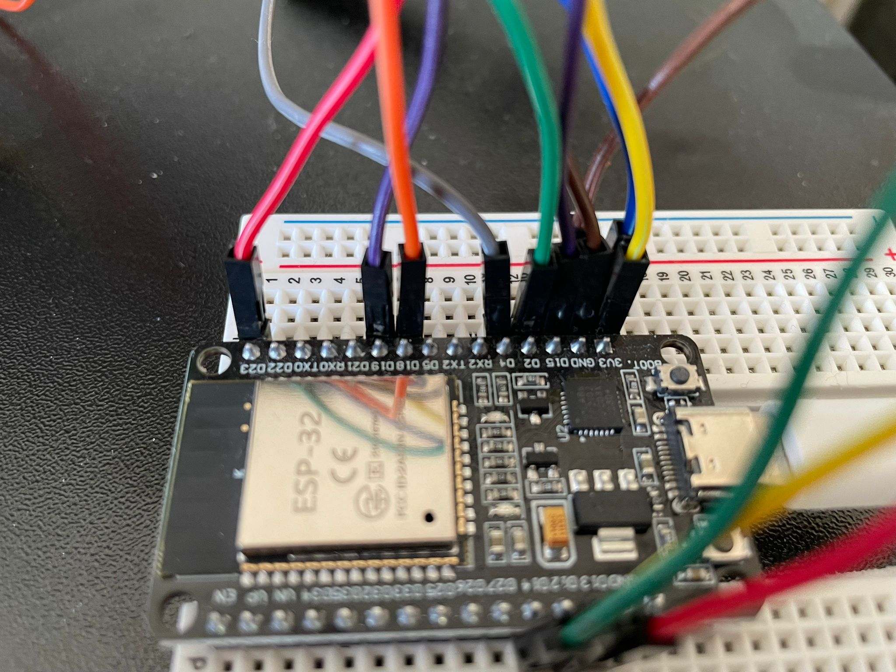

# pc-monitoring-with-esp

I built a computer monitoring program which shows you cpu, ram and gpu usage, gpu temperature, vram usage and currently used power. Additionally, it calculates the overall used power and how much your session (from connecting the program to your esp) aprox. costed.
The application shows different colors which indicate if one component is at a critical value. The program is written and functioning on Windows 11.

Following I describe which components I used (with links, as of 01. Dec 2025) and how I used them. You can download all code and recreate this project.

Have fun :)

## Disclaimer
I am an absolute beginner and this is one of my first mini-projects. With that said, many things can be wrong or underperforming.
Feel free to [contact me](https://discord.gg/phD7Wzf2) to tell me what to change or improve.

I did not search for vulnerabilities. Therefore, it is possible some side effects occure. I do not take responsibility for any damage or other negative side effects (i am using my app by myself, my Windows did not say something to me).

## Showcase
TODO: Showcase

## Components

### What to buy
I used following components. The prices are from 1. December 2025.

- [micro controller](https://amzn.eu/d/e7BkkHr), 6,99 €
- [traffic light leds](https://amzn.eu/d/hFKLvPI), 5,59 €
- [LAFVIN 3.2 inch TFT LCD Touch Display (320x240 px)](https://amzn.eu/d/9bgEoQS), 15,99 €
- [jumper cable](https://amzn.eu/d/e8eDK16), 5,94 €
- [bread boards](https://amzn.eu/d/4nmU4Gx), (you need only one), 7,64 €

- Overall price: 42,15 €

### Computer Hardware
TODO: nur mit NVIDIA?

## Arduino
TODO: intro

### Wiring
The first important step is to wire the arduino correctly. Especially the screen is a little complicated but nothing to worry about. Secondly, I added a traffic light to determine if the arduino received valid data.

#### ILI9341-Touchscreen

We need to connect the ILI9341 to the Arduino. I have chosen the following wiring for this:
- SDO(MISO): D19
- LED: 3V3
- SCK: D18
- SDI(MOSI): D23
- DC: D2
- RESET: D4
- CS: D15
- GND: GND
- VCC: 3V3

#### Status Light
The status light has four connections, which I have wired as follows:
- GND: GND
- R: D13
- Y: D12
- G: D14

### Programming
#### IDE
I used [the official Arduino IDE](https://www.arduino.cc/en/software/) to both program and upload the script to my esp32. I do not know of other programs to do so.
Follow the instructions to install the Arduino IDE and continue with the next chapter.

#### Libraries
Once you've downloaded and configured your IDE (e.g. set up your working directory) you have to install the two libraries used in the script.

1. Click on libraries (TODO: FOTO)
2. Install the libraries (TODO: libraries listen)
3. Go to your working directory into the ili9341-folder
4. Edit the User_Setup.h File.
5. TODO: was muss geändert werden?

#### Script
Now, copy the script of my project to your working directory and open it using the Arduino IDE. 

You can change certain things you want to alter e.g. the red zone, the kW price or the format of the clock.

#### Upload
Once you're happy you can upload the script to your micro controller.
Therefore, you have to pick the correct port (in which you plugged your micro controller in to) and the correct arduino (for my setup NodeMCU32S).
Now, you can click on upload.

If you did everything correctly, there should be a little eevee on your ILI-Screen. If it is completely white, their could be something wrong with your wiring or your User_Setup.h of your ILI-lib.

## Computer
Next we want to continue with setting up your computer and its script to send your data to the arduino.

### Programming
TODO: VENV? IDE? WD?

### Usage
Follow these steps to correctly set up your terminal, install the requirements and start the program:
1. 
2.

## Casing
After our Arduino is receiving correct data, we can add a casing to our project so it looks nice and can be placed anywhere easily.

I provided a file which you can use to 3D-print the casing. Additionally, I will add the measurements I did. Feel free to alter my file.

## Improvements
- you can add a messaging logic (e.g. with Windows Toasts) to inform you if a component is overloaded.

## Criticism
- sometimes the display gets fully white for no obvious reason.

## Result
Finally you have your very own monitoring tool with visual feedback about your components.

I hope you enjoyed my tutorial. If you want to feel free to send me a picture of your build on [Discord](https://discord.gg/phD7Wzf2) :) I would love to see it in action! 
