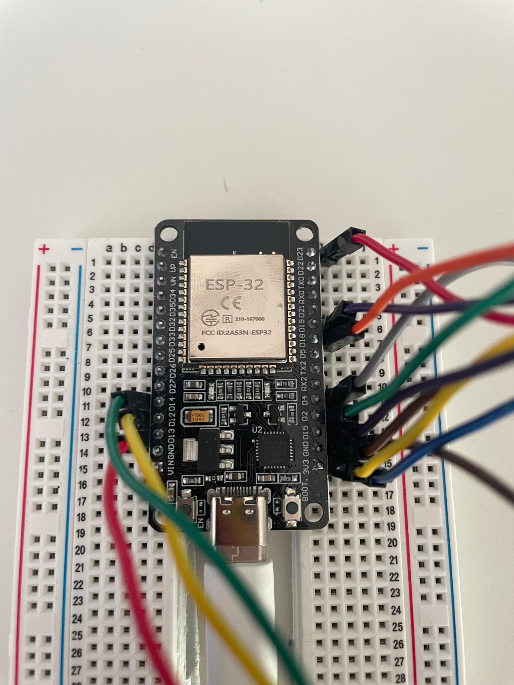
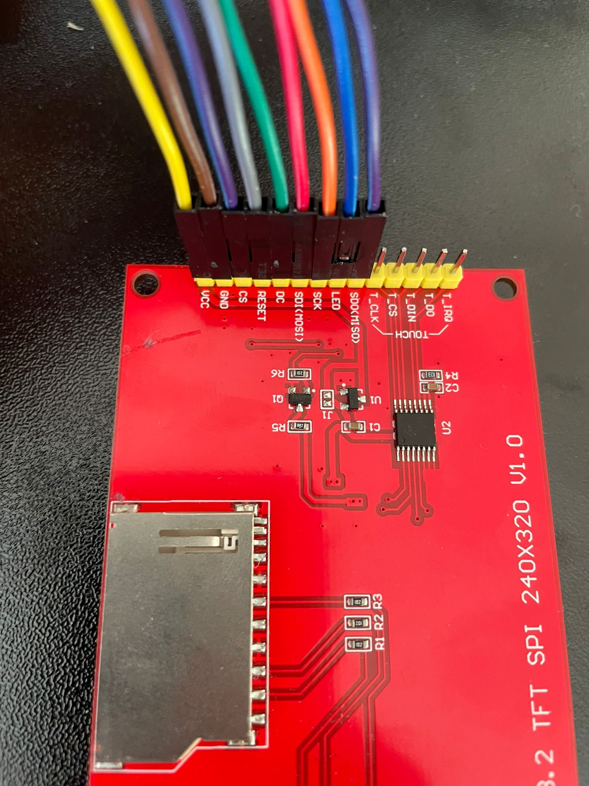

# PC Monitoring with ESP32 and ILI9341

## 1. Overview
### What does this project do?
This project implements a pc monitoring application. It shows component usages of CPU, GPU and your electricity usage.

### Why does it exist?
I am a student in my final year of bachelor studies. I wanted to build a little project to level up my skills and share my work with you. Secondly, I would appreciate you to leave feedback and optimize my project.

### Supported platforms
I used Windows to build and run my application. It is required to have a NVIDIA GPU, because of the program's structure. Other combinations weren't tested.

## 2. Showcase
- Photos of the finished build

## 3. Features
This project provides the following key features:

Displayed metrics: Monitors your PC’s CPU, RAM, and GPU usage, GPU temperature, VRAM usage, and current power consumption in real time.

Color & LED status logic: The display and the traffic light LEDs indicate normal, warning, and critical states for each component.

Session cost calculation: Estimates the power consumption and approximate cost of your session from the moment you connect the program to the ESP32.

## 5. Components

### 5.1 What to Buy

- [micro controller](https://amzn.eu/d/e7BkkHr), 6,99 €
- [traffic light leds](https://amzn.eu/d/hFKLvPI), 5,59 €
- [LAFVIN 3.2 inch TFT LCD Touch Display (320x240 px)](https://amzn.eu/d/9bgEoQS), 15,99 €
- [jumper cable](https://amzn.eu/d/e8eDK16), 5,94 €
- [bread boards](https://amzn.eu/d/4nmU4Gx), (you need only one), 7,64 €

- Overall price: 42,15 € (as of 1. December 2025)

## 6. Project Structure
- Repository layout

## 7. Arduino / ESP32 Setup

### 7.1 Requirements
Before you start programming the ESP32, make sure you have the following set up:

Arduino IDE: Install the latest version from the official Arduino website.

Board Selection: Make sure the NodeMCU-32S (or your ESP32 variant) is correctly installed in the Arduino IDE. You also need to select the correct board and port before uploading any sketches.

### 7.2 Wiring

#### 7.2.1 ILI9341 Touchscreen

<p align="center">
  
  
</p>

| ILI9341 Pin | ESP32 Pin | Description        |
|------------|-----------|--------------------|
| SDO (MISO) | D19       | SPI data from LCD  |
| SDI (MOSI) | D23       | SPI data to LCD    |
| SCK        | D18       | SPI clock          |
| CS         | D15       | Chip select        |
| DC         | D2        | Data / Command     |
| RESET      | D4        | Display reset      |
| LED        | 3V3       | Backlight power    |
| VCC        | 3V3       | Power supply       |
| GND        | GND       | Ground             |


#### 7.2.2 Status / Traffic Light LEDs

| Status Light Pin | ESP32 Pin | Meaning              |
|-----------------|-----------|----------------------|
| GND             | GND       | Ground               |
| R (Red)         | D13       | Critical value       |
| Y (Yellow)      | D12       | Warning / high load  |
| G (Green)       | D14       | Normal operation     |

### 7.3 Libraries
- TFT_eSPI – controls the ILI9341 display
- eevee72x72 – custom sprite/image used in the project
- esp32-hal – hardware abstraction layer (usually included with the Arduino ESP32 core)

2. Installation Steps

- Open the Arduino IDE.
- Navigate to Sketch → Include Library → Manage Libraries…
- Search for TFT_eSPI and install it.
- Place eevee72x72.h in your project folder (usually inside the src or main sketch directory).
- Ensure the ESP32 board support is installed via Tools → Board → Board Manager → ESP32 by Espressif Systems.

3. User_Setup.h Changes

Open User_Setup.h in the TFT_eSPI library folder.
Adjust the pin definitions to match your wiring table:

```cpp
#define TFT_MOSI  23
#define TFT_MISO  19  // optional, used only if SPI read is required
#define TFT_SCLK  18
#define TFT_CS    15
#define TFT_DC     2
#define TFT_RST    4
#define SPI_FREQUENCY 27000000
```

Optional settings (fonts, backlight, display type) can be left as default for your ILI9341.
Save the file before uploading the sketch.

⚠️ Important: Incorrect User_Setup.h configuration can result in a blank or non-responsive display. Always double-check the pins match your wiring table.

### 7.4 Arduino Script
The Arduino sketch controls the ESP32, reads serial data from your PC, and updates both the ILI9341 display and the traffic light LEDs.

#### 7.4.1 Configuration Options
You can customize the following constants in the sketch to match your setup:

```cpp
#define RED_LED    13
#define YELLOW_LED 12
#define GREEN_LED  14

const unsigned long updateInterval = 5000;  // Display update interval in milliseconds
const float pricePerKWh = 0.2985;          // Electricity price per kWh
```
Additionally, the TFT pins are set in User_Setup.h as described in section 7.3.

#### 7.4.2 Important constants
`cpu`, `ram`, `gpul`, `gput`, `vram`, `vramt` → store the PC metrics received via Serial
`totalEnergy_Wh` → keeps track of energy usage
`currentTime` → stores the local time for display
`lastUpdate` → controls the display refresh interval

#### 7.4.3 Customization Tips
- Display Positioning: Change the coordinates in drawStats() to rearrange displayed values.
- Thresholds for LEDs/Bars: Adjust values in drawStats() to modify warning and critical thresholds for CPU, RAM, and GPU.
- Eevee Image: Replace eevee72x72 with your own sprite if desired.
- Update Interval: Modify updateInterval to refresh the display more or less frequently.

⚠️ Ensure all constants and pin definitions match your wiring and User_Setup.h settings. Otherwise, the display or LEDs may not work correctly.

### 7.5 Uploading the Sketch
After configuring the Arduino IDE and your libraries, you can upload the sketch to your ESP32.

#### Board & Port Selection
1. Connect your ESP32 to your PC via USB.
2. In the Arduino IDE, go to Tools → Board → ESP32 Arduino → NodeMCU-32S (or your ESP32 variant).
3. Select the correct Port under Tools → Port.
      - On Windows, it usually appears as COMx.

#### Uploading
Click the Upload button in the Arduino IDE (arrow pointing right).
Wait for the compilation and upload to complete.

💡 Tip: After a successful upload, your ESP32 should display the Eevee image.

#### Common Problems & Tips

| Problem | Solution |
|---------|---------|
| **Blank display after upload** | Double-check `User_Setup.h` pins and wiring. Ensure `TFT_CS`, `TFT_DC`, `TFT_RST` match your connections. |
| **Sketch fails to compile** | Make sure all required libraries (`TFT_eSPI`, `eevee72x72`) are installed and the ESP32 board support is up-to-date. |
| **Upload fails** | Try pressing the ESP32 **BOOT** button while uploading. Check that no other program (like Serial Monitor) is using the same COM port. |
| **LEDs not responding** | Verify wiring and pin definitions (`RED_LED`, `YELLOW_LED`, `GREEN_LED`) match the sketch. |

## 8. PC Application Setup

### 8.1 Requirements
- Python 3.x (tested with 3.11)
- Optional: Virtual environment (`venv`)
- Required permissions: access to serial ports, registry modification (Windows autostart)

### 8.2 Installation
#### 8.2.1 Optional: Create a Virtual Environment
It is recommended to use a virtual environment to avoid conflicts with other Python packages.

- create a venv: ```python -m venv venv```
- activate it:
    - Windows (cmd): ```venv\Scripts\activate```
    - Windows (PowerShell): ```venv\Scripts\Activate.ps1```
    - Linux/macOS: ```source venv/bin/activate```

### 8.2.2 Install Dependencies
install the required Python packages:
```pip install -r requirements.txt```
or install manually:
```pip install psutil pystray Pillow pywin32 win10toast```

### 8.2.3 Configuration
Ensure the ESP32/Arduino is wired correctly and the Arduino sketch is uploaded.
Place the assets folder (```eevee-icon.png``` and ```eevee-icon.ico```) in the same directory as the script.
Optional: Configure autostart via the tray icon after running the program once.

### 8.2.4 Building the Executable
To create a standalone Windows executable using PyInstaller:
```pyinstaller --noconsole --onefile --icon=assets/eevee-icon.ico --add-data "assets/eevee-icon.png;assets" eeveemonitoring.py```


### 8.3 Running the Application
#### 8.3.1 Start the Program
Run the Python script 
    ```bash
    python eeveemonitoring.py
    ```
or the Executable (Windows)
    ```eeveemonitoring.exe```

#### 8.3.2 Expected Output
- A tray icon appears in the system tray (Eevee icon).
- If the ESP32/Microcontroller is connected, a notification will show:
    ```Die Verbindung zum Microcontroller wurde an Port COMx hergestellt.```
- CPU, RAM, GPU stats, VRAM usage, and power will start being sent to the ESP32.

#### 8.3.3 First Connection
Make sure the Arduino sketch is uploaded and the ESP32 is powered on.
The tray icon automatically searches for a connected microcontroller for up to 60 seconds.
If successful, the status LED on the ESP32 will turn green and the TFT will display the monitoring interface.
If no device is found after 60 seconds, a notification will alert you and the program will stop.

## 9. Usage
- Normal workflow
- Interpreting values
- LED & color meanings

## 10. Casing
coming soon ...

## 11. Known Issues
Contact me if something is wrong

## 12. Improvements & Roadmap
- Planned features
- Possible extensions

## 13. Disclaimer
This project is a beginner project and one of my first mini-projects.
Therefore, parts of the code or hardware setup may be inefficient, incomplete, or incorrect.

I did not actively search for vulnerabilities. As a result, unexpected behavior or side effects may occur.

I do not take responsibility for any damage, data loss, hardware issues, or other negative effects caused by using this project.
Use it at your own risk.

If you have suggestions, improvements, or feedback, feel free to [contact me](https://discord.gg/phD7Wzf2).

## 14. License
This project is licensed under the **MIT License**.  
You are free to use, modify, and distribute this project, provided that the original copyright
notice and license text are included.

See the [LICENSE](LICENSE) file for more information.

## 15. Contact & Feedback
If you have questions, suggestions, or feedback, feel free to reach out:

Discord: [Join here](https://discord.gg/phD7Wzf2)
Contributions: Pull requests are welcome!

We appreciate any help to improve this project, fix bugs, or add new features.
